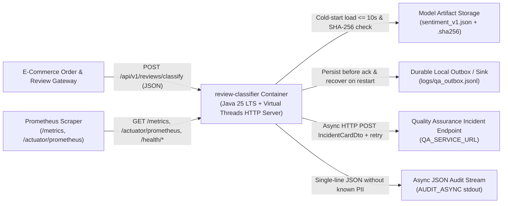

# C4 Container Diagram

Контейнерная диаграмма взаимодействия микросервиса классификации отзывов с внешними системами, хранилищем словаря модели, файловым durable outbox и наблюдаемостью.

```mermaid
flowchart LR
    CustomerPortal["E-Commerce Order & Review Gateway"]
    Classifier["review-classifier Container\n(Java 25 LTS + Virtual Threads HTTP Server)"]
    ModelStore["Model Artifact Storage\n(sentiment_v1.json + .sha256)"]
    QaSystem["Quality Assurance Incident Endpoint\n(QA_SERVICE_URL)"]
    Outbox["Durable Local Outbox / Sink\n(logs/qa_outbox.jsonl)"]
    AuditStdout["Async JSON Audit Stream\n(AUDIT_ASYNC stdout)"]
    Prometheus["Prometheus Scraper\n(/metrics, /actuator/prometheus)"]

    CustomerPortal -->|"POST /api/v1/reviews/classify (JSON)"| Classifier
    Classifier -->|"Cold-start load <= 10s & SHA-256 check"| ModelStore
    Classifier -->|"Persist before ack & recover on restart"| Outbox
    Classifier -->|"Async HTTP POST IncidentCardDto + retry"| QaSystem
    Classifier -->|"Single-line JSON without known PII"| AuditStdout
    Prometheus -->|"GET /metrics, /actuator/prometheus, /health/*"| Classifier
```
