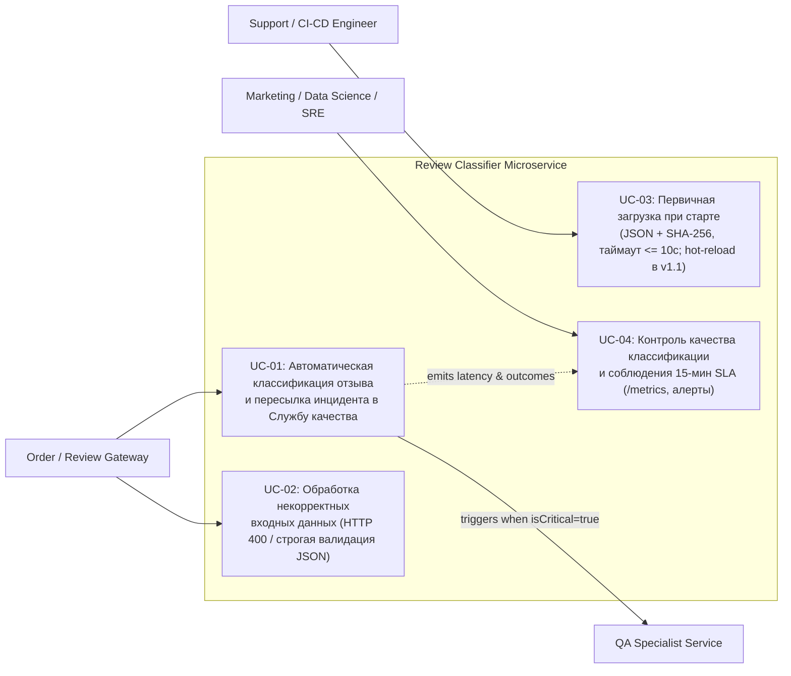

# Use Case Map (UC-01 .. UC-04, синхронизировано с 1.xlsx)

```mermaid
flowchart LR
    Gateway["Order / Review Gateway"]
    Ops["Support / CI-CD Engineer"]
    Monitor["Marketing / Data Science / SRE"]
    QaEngineer["QA Specialist Service"]

    subgraph System ["Review Classifier Microservice"]
        UC01["UC-01: Автоматическая классификация отзыва\nи пересылка инцидента в Службу качества"]
        UC02["UC-02: Обработка некорректных\nвходных данных (HTTP 400 / строгая валидация JSON)"]
        UC03["UC-03: Первичная загрузка при старте\n(JSON + SHA-256, таймаут <= 10с; hot-reload в v1.1)"]
        UC04["UC-04: Контроль качества классификации\nи соблюдения 15-мин SLA (/metrics, алерты)"]
    end

    Gateway --> UC01
    Gateway --> UC02
    Ops --> UC03
    Monitor --> UC04
    UC01 -->|"triggers when isCritical=true"| QaEngineer
    UC01 -.->|"emits latency & outcomes"| UC04
```
