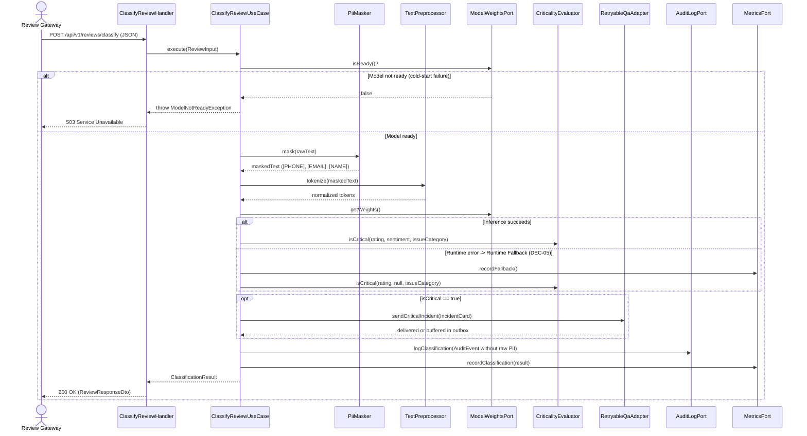

# Sequence Diagram — POST /api/v1/reviews/classify

```mermaid
sequenceDiagram
    actor Client as Review Gateway
    participant HTTP as ClassifyReviewHandler
    participant UC as ClassifyReviewUseCase
    participant PII as PiiMasker
    participant Prep as TextPreprocessor
    participant Model as ModelWeightsPort
    participant Crit as CriticalityEvaluator
    participant QA as RetryableQaAdapter
    participant Audit as AuditLogPort
    participant Metrics as MetricsPort

    Client->>HTTP: POST /api/v1/reviews/classify (JSON)
    HTTP->>UC: execute(ReviewInput)
    UC->>Model: isReady()?
    alt Model not ready (cold-start failure)
        Model-->>UC: false
        UC-->>HTTP: throw ModelNotReadyException
        HTTP-->>Client: 503 Service Unavailable
    else Model ready
        UC->>PII: mask(rawText)
        PII-->>UC: maskedText ([PHONE], [EMAIL], [NAME])
        UC->>Prep: tokenize(maskedText)
        Prep-->>UC: normalized tokens
        UC->>Model: getWeights()
        alt Inference succeeds
            UC->>Crit: isCritical(rating, sentiment, issueCategory)
        else Runtime error -> Runtime Fallback (DEC-05)
            UC->>Metrics: recordFallback()
            UC->>Crit: isCritical(rating, null, issueCategory)
        end
        opt isCritical == true
            UC->>QA: sendCriticalIncident(IncidentCard)
            QA-->>UC: delivered or buffered in outbox
        end
        UC->>Audit: logClassification(AuditEvent without raw PII)
        UC->>Metrics: recordClassification(result)
        UC-->>HTTP: ClassificationResult
        HTTP-->>Client: 200 OK (ReviewResponseDto)
    end
```
